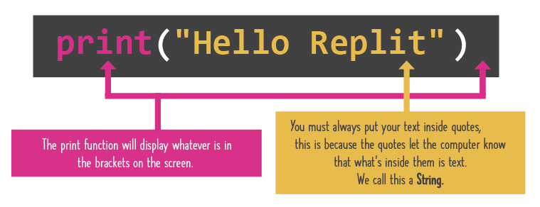

Start at 2:37

# Print Statements
You just learned your first command: the print statement. It says "Print out whatever's in my brackets". The print statement is how you get your program to put messages in the console.

